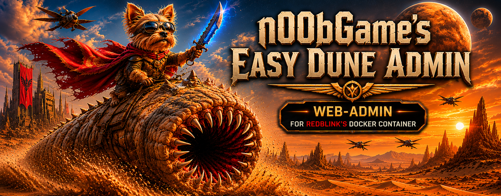
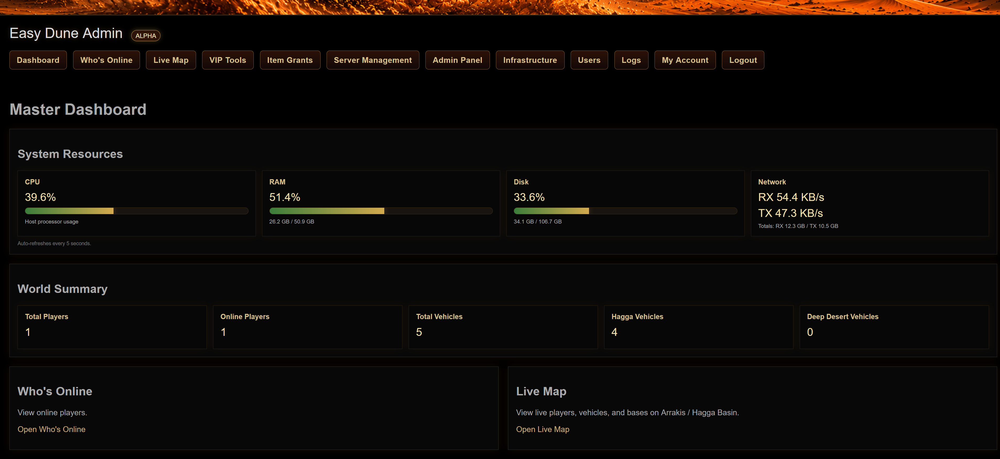
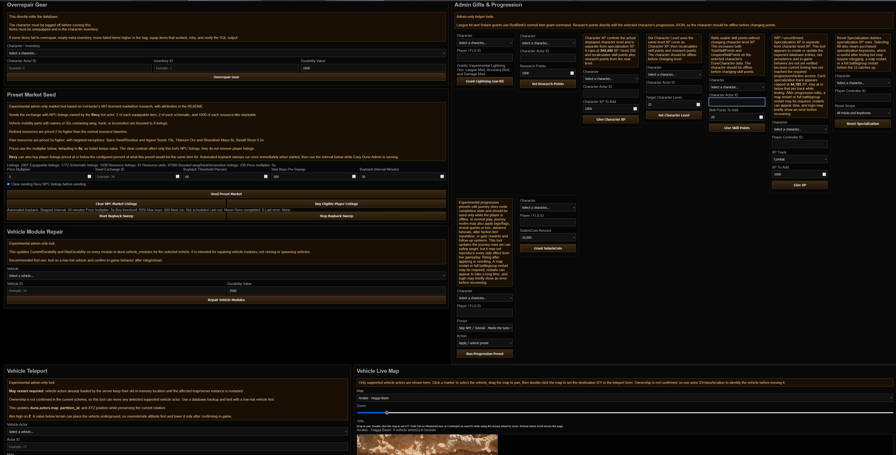
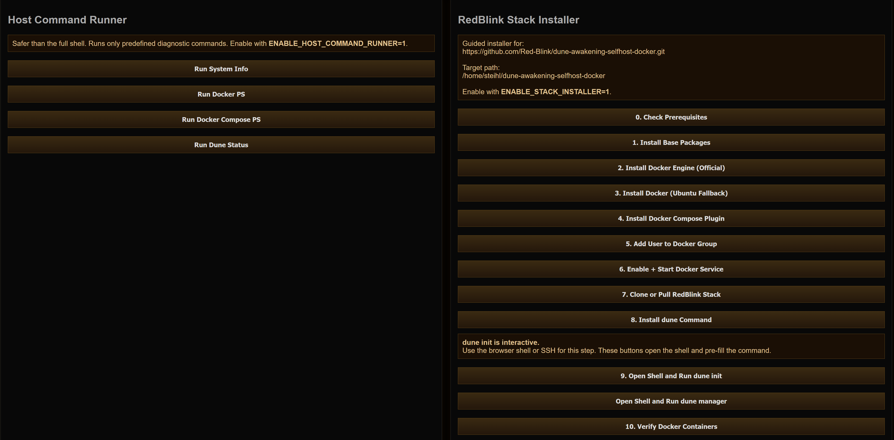
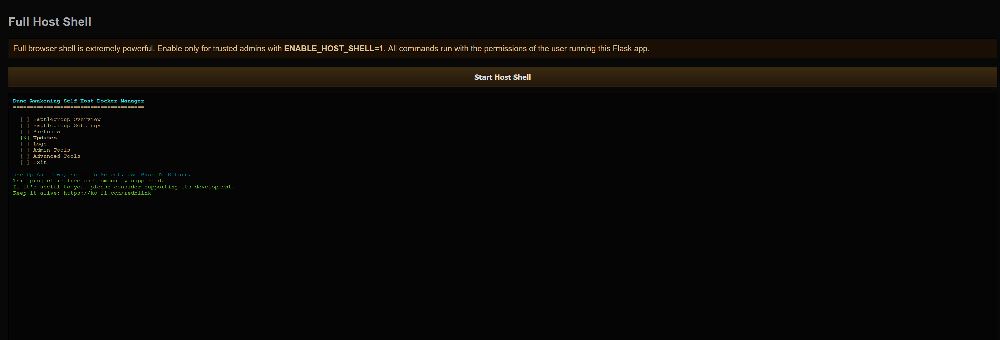

<h1 align="center">Easy Dune Admin</h1>

<p align="center">
  Independent companion administration platform for RedBlink's Dune Awakening self-hosted Docker stack.
</p>

<p align="center">
  
  
  
  
  
  
</p>

<p align="center">
  
</p>

---

## Status

Current panel version: `0.7.0-beta`

Target RedBlink Stack: `v1.3.2`

This beta is intended for private/LAN/VPN-hosted self-hosted servers.

Easy Dune Admin is an independent webadmin project built to support
RedBlink's MIT-licensed
[`dune-awakening-selfhost-docker`](https://github.com/Red-Blink/dune-awakening-selfhost-docker)
stack. Development is being continued with RedBlink's blessing/request for a
fuller webadmin, while keeping RedBlink's stack, scripts, command workflows,
and contributors credited where they are used or targeted.

---

## Screenshots

### Dashboard



### Admin Panel



### Live Map


### Infrastructure



### RedBlink Manager Shell Workflow



---

## Features

### Dashboard

- Live CPU/RAM/Disk usage bars
- Network RX/TX totals and rates
- AJAX auto-refresh
- World/player/vehicle summary cards

### Live Maps

- Hagga Basin live map
- Deep Desert map support
- Player, vehicle, and base markers
- Mouse-wheel zoom
- Drag panning
- Click-to-fill teleport coordinates

### Teleportation

- Offline teleportation
- Character dropdown targeting
- Emergency return to safe Hagga Basin point
- Hagga Basin partition: `1`
- Deep Desert partition: `8`

### Vehicle Teleport

- Admin-only vehicle relocation using `dune.actors`
- Preserves existing vehicle rotation while updating map, partition, and XYZ
- Supported actor families: Ornithopter, Sandbike, Buggy, TreadWheel, SandCrawler
- Zoomable, draggable admin vehicle map with double-click coordinate targeting
- Requires restarting the affected map/server instance before loaded vehicles appear at the new location
- Z-axis warning because below-terrain values can place vehicles underground

### Item Grants

- Item search
- Item grant tools
- Mk6 Scout Ornithopter grant
- Mk6 Medium Ornithopter grant
- Medium thopter kit includes 250 rockets
- Admin-only Lightning Gun kit grant using the normal RedBlink item grant command
- Admin-only SolarisCoin grant with preset amount dropdown
- Admin-only research point setter for selected characters
- Admin-only character XP grant for the actual displayed character level
- Admin-only set character level tool using the same level XP curve
- WIP/unconfirmed admin-only specialization XP grant for Combat, Crafting, Gathering, Exploration, and Sabotage tracks. It appears to create/update the expected database entries, but persistence and in-game behavior still need confirmation after reaching the required progression/faction access.
- Admin-only specialization reset for one track or all tracks plus keystones
- Experimental admin-only progression preset apply/reset tools for curated journey roots
- Progression edits may require relogging, restarting the affected map, or restarting the battlegroup. Restarts can appear slow, and login may briefly show an error before recovering.

### Market Tools

- Admin-only preset market seeding
- Seeds NPC exchange listings for equippable items, schematics, and resources
- Uses a `Revy`-style bot owner and `is_npc_order = TRUE`
- Seed Exchange ID override supports servers whose visible player market is not the DB `Global` exchange id
- Default preset clears only the market bot's existing NPC listings before reseeding
- Per-run price multiplier input defaults to 5x so Solari keeps value on private servers
- Items or schematics with names/IDs containing `wing`, `track`, or `locomotion` seed 8 listings by default
- Refined resources use an additional 2.5x category price multiplier
- Raw resources use an additional 5x category price multiplier, with overrides for Spice Sand/Residue, Titanium Ore, Stravidium Mass, Agave Seeds, and Basalt Stone
- Clear NPC Market Listings button removes the bot's NPC listings without relisting
- Buy Eligible Player Listings lets Revy buy player listings priced at or below 60% of the current preset price
- Buyback threshold, max buys per sweep, and sweep interval are editable in the Admin UI
- Start/Stop Buyback Sweep controls run Revy buyback immediately once, then on the configured interval while Easy Dune Admin is running
- Market category mapping and item-data research adapted from IceHunter / Ryan Wilson's MIT-licensed dune-admin project

### Repair Tools

- Admin-only gear overrepair
- Admin-only vehicle module repair
- Sane default repair values with editable durability fields

### VIP Tools

- VIP role with viewer-safe access plus self-service tools
- Admin-managed exact character-name link for each VIP web account
- Self-only overrepair for the linked character inventory
- Self-only offline teleport using the linked character account/FLS ID
- Self-only Mk6 Scout and Mk6 Medium Ornithopter grants

### Server Management

- Grouped restart controls:
  - Gameplay Services: Survival, Deep Desert, Overmap
  - Infrastructure Services: Gateway, Director, Text Router
- Map spawn controls
- RedBlink v1.3.2 map runtime controls:
  - `dune maps list`
  - `dune maps mode`
  - `dune maps set <map> dynamic`
  - `dune maps set <map> always-on`
  - `dune maps reconcile`

### Deep Desert

- Dual PvP/PvE status
- Enable dual mode
- Disable dual mode
- Force disable dual mode
- Bootstrap dual mode
- Repair dual mode

### Database Tools

Safe database actions:

- DB Health
- DB Status
- List Backups
- Create Backup

Restore/import/delete database actions are intentionally not exposed yet.

### Infrastructure

- Host diagnostics
- Docker diagnostics
- Guided RedBlink installer
- Browser-based host shell
- Open Shell + `dune init`
- Open Shell + `dune manager`

---

## Requirements

```bash
sudo apt update
sudo apt install -y \
python3 \
python3-pip \
python3-venv \
git \
curl
```

---

## Installation

```bash
git clone https://github.com/n00bgames/Easy-Dune-Admin.git
cd Easy-Dune-Admin

python3 -m venv venv
source venv/bin/activate
pip install -r requirements.txt

chmod +x setup.sh
./setup.sh

chmod +x start.sh restart.sh shutdown.sh
./start.sh
```

Browse to:

```text
http://127.0.0.1:8088
```

---

## Runtime Control

```bash
./start.sh --screen       # detached GNU screen session
./start.sh --headless     # nohup background process with webadmin.pid
./restart.sh              # restarts using the detected/current launch mode
./shutdown.sh             # stops screen or headless mode
```

For screen mode:

```bash
screen -r dune-admin-web
```

Detach from screen with `Ctrl+A`, then `D`.

---

## Configuration

Default RedBlink stack path:

```bash
~/dune-awakening-selfhost-docker
```

Override with:

```bash
export DUNE_ROOT=/path/to/dune-awakening-selfhost-docker
```

Set a real secret before sharing or deploying:

```bash
export DUNE_SECRET_KEY='long-random-string'
```

Optional high-trust infrastructure features:

```bash
export ENABLE_HOST_COMMAND_RUNNER=1
export ENABLE_STACK_INSTALLER=1
export ENABLE_HOST_SHELL=1
```

Optional RedBlink installer target override:

```bash
export REDBLINK_INSTALL_DIR=/path/to/dune-awakening-selfhost-docker
```

---

## Upgrading

Before replacing a running copy, back it up:

```bash
cp -a ~/dune-admin-web ~/dune-admin-web.backup-before-0.7.0-beta
```

Preserve local runtime data:

- `users.db`
- `logs/`
- `.env`, if used

Then update:

```bash
git pull
source venv/bin/activate
pip install -r requirements.txt
./start.sh
```

---

## Runtime Assets

Runtime assets live in `static/`:

- `dune-admin.js`
- `dune-admin.png`
- `dune-admin-large.png`
- `arrakis_hb.webp`
- `deep_desert.webp`

The map image files are required for the live map pages to render properly.

GitHub README screenshots live in `images/`:

- `dashboard.png`
- `dune-manager.png`
- `infrastructure.png`
- `live-map.png`
- `logo.png`

When dashboard, live map, infrastructure, or README sections change, refresh the matching image before publishing.

---

## Line Endings

The repository includes `.gitattributes` rules to keep Linux shell scripts using LF line endings.

If shell scripts still fail with `cannot execute: required file not found` or `/bin/bash^M`, run:

```bash
find . -type f -name "*.sh" -exec sed -i 's/\r$//' {} \;
chmod +x setup.sh start.sh restart.sh shutdown.sh
```

---

## Security Notes

This project is intended for LAN/private/VPN environments. Do not expose it directly to the public internet.

`setup.sh` creates a restricted sudoers file under:

```text
/etc/sudoers.d/dune-web-admin
```

The optional browser host shell runs with the permissions of the Linux user that launches `app.py`. Treat it like SSH access to the host.

Viewer accounts are intentionally privacy-limited. They can see viewer-safe status, online player names, and map markers, but they cannot view sensitive database identifiers such as raw player IDs, account IDs, FLS IDs, Funcom IDs, direct logs, or admin database output.

---

## Known Issues

- Map marker styling is functional but still being refined.
- Autoscaler controls are planned.
- Vehicle repair writes directly to `dune.vehicle_modules` stats JSON.
- Vehicle teleport writes to `dune.actors`, but loaded vehicle actors do not reload their transform until the affected map/server instance restarts.
- Gear overrepair requires items to be unequipped and in inventory.
- Deep Desert teleport partition should be verified on each stack/server setup.

---

## Planned

- VIP self-only generic item grants
- Vehicle ownership discovery for VIP self-repair/teleport
- Live map side panel / scroll-safe layout
- Autoscaler controls
- Dynamic map discovery from RedBlink map runtime config

---

## Release Notes

See `CHANGELOG.md` for full release history.

Current highlight for `0.7.0-beta`: the former `app.py` monolith is split into a small launcher, shared core helpers, and route registrations so future admin tools are easier to maintain.

Looking ahead: faction manipulation tools are a likely `0.7.1` focus after faction membership and the related database state can be captured and tested safely.

---

## Credits

- RedBlink and contributors for the MIT-licensed [`dune-awakening-selfhost-docker`](https://github.com/Red-Blink/dune-awakening-selfhost-docker) stack this panel targets. This project is being developed with RedBlink's blessing/request for a fuller companion webadmin; Easy Dune Admin remains an independent project and credits RedBlink's stack, scripts, and command workflows where used.
- Funcom
- IceHunter / Ryan Wilson's MIT-licensed [`dune-admin`](https://github.com/Icehunter/dune-admin) project for market tooling research, category mapping, bundled market item data, progression preset structure, specialization XP research, and character-level XP curve research.
- Community researchers and testers

---

## License

GPLv3. See `LICENSE`.

Third-party reference material remains under its original license. See `THIRD_PARTY_NOTICES.md` for included MIT license text and attribution.

---

## AI Collaboration Note

Large portions of this project have been collaboratively created with the use of generative AI tools, including ChatGPT and Codex.
